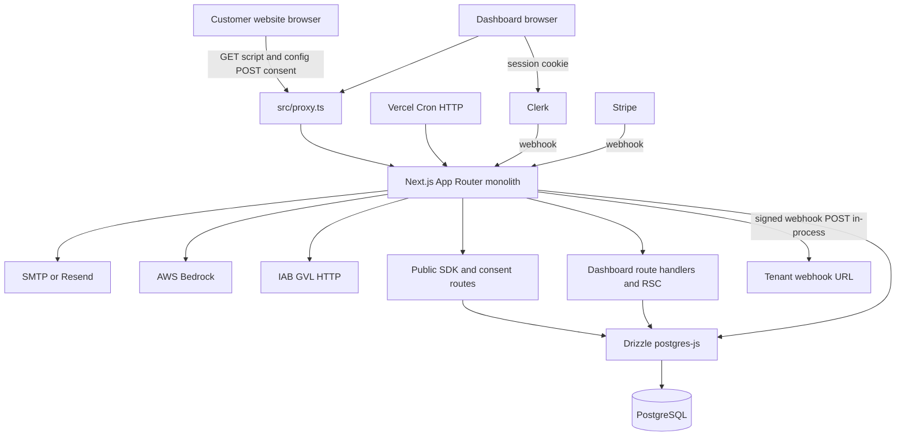
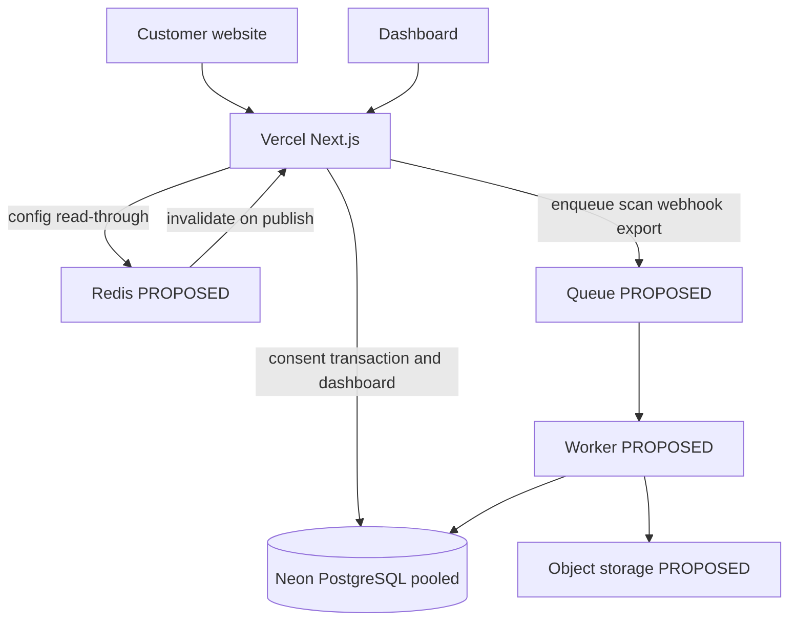
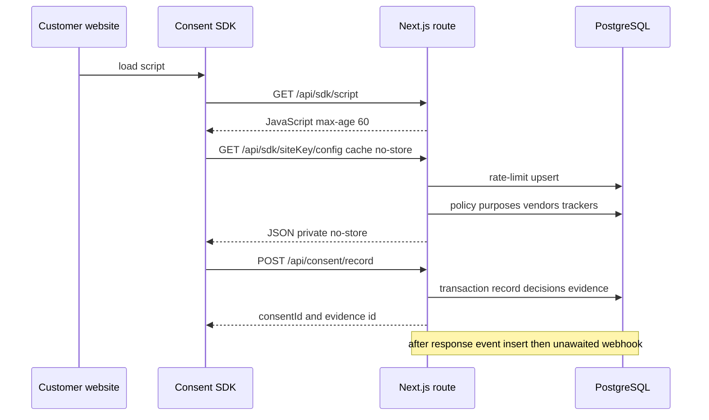
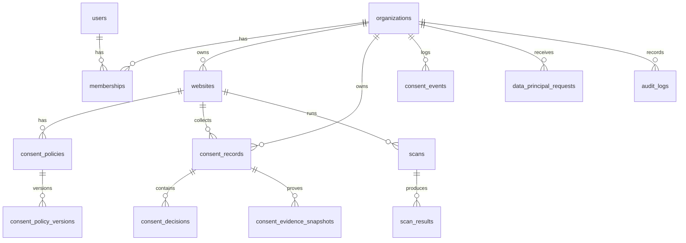
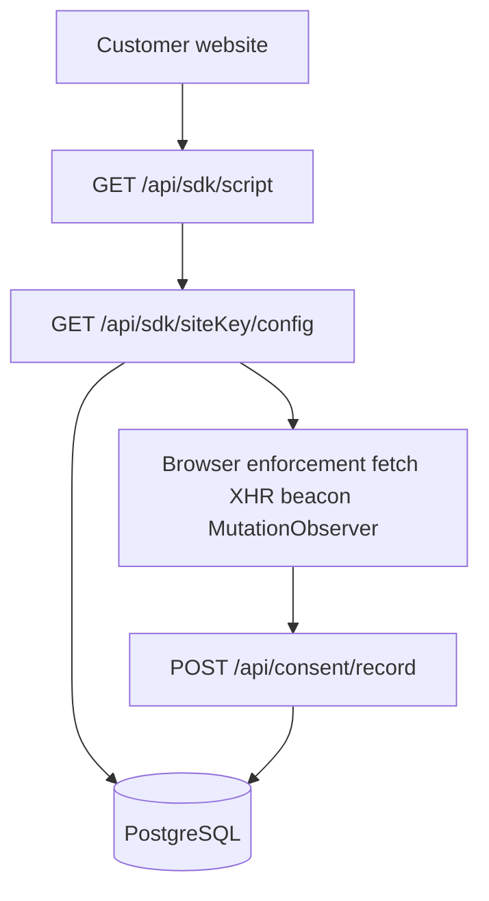

# Consent Guru Enterprise Architecture Audit

Audit date: 2 October 2026. Read-only inspection of the repository at `d:\consent-manager`. No code, schema, environment, or infrastructure was changed.

This report describes what the source implements. It does not describe production metrics. Where a fact cannot be determined from the repository, it is marked **UNKNOWN**.

---

## 1. Executive Summary

Consent Guru is a **modular monolith**: one Next.js 16 App Router application, one PostgreSQL database, one deployable. Dashboard, public consent APIs, the browser SDK, billing, scanning, and cron all run in that process. There are no microservices, no Redis, no job queue, and no separate worker.

The domain model is real. Organizations, memberships, websites, versioned policies, consent records, evidence snapshots, events, DSAR records, vendors, transfers, and audit logs exist in Drizzle schema with foreign keys and, on the hot consent tables, useful indexes. Authenticated APIs generally resolve the tenant from the Clerk session and filter by the local `organizationId`. Consent writes are transactional and idempotent on `submissionId`.

The architecture is **not enterprise-ready for high-volume public consent traffic**. Every SDK configuration request is built from PostgreSQL and returned with `Cache-Control: private, no-store`. The browser SDK fetches that URL with `cache: "no-store"` and does not send `If-None-Match`. In production, rate limiting defaults to an `INSERT ... ON CONFLICT` against `rate_limit_buckets` on each limited request, and falls back to per-isolate memory if that write fails. Scans run inside the HTTP request. Webhook delivery is started with `void` and retried in-process. Tenant isolation is application-only: every table snapshot has `isRLSEnabled: false`.

There is no load test, no distributed tracing, and no error-tracking product in the application. Scalability is **not proven**.

**Decision: NO-GO** for safely supporting enterprise customers on the current architecture.

---

## 2. Current Technology Stack

Confirmed from `package.json` and source, not from assumption.

| Layer | What the repo actually uses |
| --- | --- |
| Application | Next.js `16.3.4`, React `19.2.8`, TypeScript `^5` (`strict: true`) |
| UI | Tailwind CSS 4, React Compiler enabled in `next.config.ts` |
| Data | Drizzle ORM `^0.45.2`, driver `postgres` (postgres-js) `^3.4.9` |
| Database | PostgreSQL. Local: `docker-compose.yml` image `postgres:18`. Hosted: code special-cases `neon.tech` in `DATABASE_URL`. Neon plan, region, and pooler-vs-direct URL are **UNKNOWN** |
| Auth | Clerk (`@clerk/nextjs` `^7.8.0`). Request gate is `src/proxy.ts` (Next.js 16 proxy). No `middleware.ts` |
| Billing | Stripe (`src/lib/billing/stripe.ts`, `POST /api/webhooks/stripe`). **Razorpay is not implemented** |
| Email | Nodemailer, with a Resend HTTP fallback in `src/lib/mail/send-email.ts` |
| AI | AWS Bedrock runtime client, failure returns a deterministic fallback (`src/lib/ai/intelligence.ts`) |
| IAB | `@iabtcf/cmpapi`, `@iabtcf/core`, `@iabgpp/cmpapi` |
| PDF | `pdf-lib`, generated inside a route handler |
| Validation | Zod `^4` on some dashboard/negotiation routes. Public consent ingest is hand-validated |
| Jobs | Vercel Cron hitting `/api/cron/*`. No queue library |
| Cache | React `cache()`, process-local `src/lib/ttl-cache.ts` (max 200 entries). No Redis |
| Tests | `node --test` via `scripts/run-tests.cjs` (37 `*.test.cjs` files). Playwright is a devDependency and is not in CI |
| CI | `.github/workflows/ci.yml`: `npm ci`, `typecheck`, `test`, `npm audit --audit-level=critical` |
| Deploy config in repo | `vercel.json` crons only. No `Dockerfile`. No region, memory, or function-size config |

Router: **App Router only** (`src/app`). No `pages/` directory. No `"use server"` server actions. Mutations go through route handlers.

---

## 3. Current Architecture

**Classification: modular monolith (single deployable).**

Evidence: one `package.json`, no npm workspaces, path alias `@/*` → `./src/*`. Domain folders under `src/lib` (`scanner`, `sdk`, `billing`, `privacy-rights`, `webhooks`, `intelligence`) are imported by route handlers in the same process. They are not separately deployed services.

```text
Browser / customer website
   ↓
Next.js 16 (Vercel serverless functions — deployment target implied by vercel.json + VERCEL check in db client)
   ↓
src/proxy.ts  (Clerk session, CSRF origin check, public-route allowlist)
   ↓
Route handler or Server Component
   ↓
src/lib/* business logic
   ↓
Drizzle (postgres-js)
   ↓
PostgreSQL (Neon when DATABASE_URL contains neon.tech; local Docker otherwise)
```

External systems that the code calls:

| System | Role | Where |
| --- | --- | --- |
| Clerk | Login, session, org switcher, org/user webhooks | `src/proxy.ts`, `src/app/layout.tsx`, `POST /api/webhooks/clerk` |
| Stripe | Checkout, portal, subscription webhooks | `src/lib/billing/stripe.ts` |
| SMTP / Resend | Pricing and DPO enquiry mail | `src/lib/mail/send-email.ts` |
| AWS Bedrock | Optional intelligence enrichment | `src/lib/ai/intelligence.ts` |
| IAB Global Vendor List | Fetched by cron | `GET/POST /api/cron/iab-gvl` |
| Customer websites | Scanner `fetch` of the tenant's own URL, SSRF-guarded | `src/lib/scanner/html-analyser.ts` |
| Tenant webhook URLs | Outbound signed POST | `src/lib/webhooks/delivery.ts` |

Not present:

- Redis or any other distributed cache
- Queue, worker process, or dead-letter store
- Object storage (S3 or equivalent)
- CDN cache rules for SDK configuration (script has a 60s `Cache-Control`; config does not)
- Separate public API service

Cron (from `vercel.json`):

| Path | Schedule | `maxDuration` |
| --- | --- | --- |
| `/api/cron/scans` | hourly | 60s |
| `/api/cron/iab-gvl` | daily 03:00 | 30s |
| `/api/cron/policies` | every 5 minutes | 30s |

---

## 4. Architecture Diagram



Proposed components are not drawn here. They are in section 25.

---

## 5. Request/Data Flow

### Dashboard

```text
Browser
→ Clerk session cookie
→ src/proxy.ts auth.protect() for /dashboard
→ Server Component layout (src/app/dashboard/layout.tsx)
→ bootstrapCurrentContext() maps Clerk user/org to local users, organizations, memberships
→ page queries (React cache() dedupes within one request)
→ Drizzle → PostgreSQL
→ HTML
```

Home counts (`src/lib/dashboard/home-queries.ts`) run several `count(*)` subqueries over `consent_records`, `websites`, `trackers`, `vendors`, and policies, then store the result in a **process-local** map for 30 seconds. A second serverless isolate does not see that map.

Latency-sensitive: yes, user-facing. Synchronous: yes. External: Clerk `auth()` on each request. Failure: database errors surface as the dashboard error boundary (`src/app/dashboard/error.tsx`). Retry: none in application code. Timeout: postgres-js `connect_timeout: 10`.

### Login

```text
Browser
→ Clerk hosted sign-in (ClerkProvider in src/app/layout.tsx)
→ Clerk session
→ proxy allows the session
→ local user/org rows created or updated via bootstrap and POST /api/webhooks/clerk
→ membership role mapped by clerkRoleToLocalRole (Owner / Admin / Member)
```

If Clerk is not configured in production, `productionUnconfiguredProxy` returns 503 for private pages and non-health APIs. Public marketing pages and `/api/health` still respond. Consent APIs would also be unavailable in that mode because they are under `/api/` and are not in the unconfigured-production allowlist except health.

### Consent SDK

```text
Customer website
→ GET /api/sdk/script  (public, max-age=60)
→ SDK reads siteKey from the embed
→ GET /api/sdk/{siteKey}/config?  cache: "no-store"
   → origin allowlist
   → Postgres rate-limit upsert (production default)
   → website, policy, version, purposes, vendors, trackers, org, GVL, jurisdiction
   → 304 only if the caller sent If-None-Match (the SDK does not)
→ banner + tracker rules in the browser
→ POST /api/consent/record
```

The SDK patches `fetch`, XHR, `navigator.sendBeacon`, cookie writes, and uses `MutationObserver` (`src/lib/sdk/cmp-sdk-script.ts`). Blocking is in the browser. The decision record is not local-only: it is a synchronous write to PostgreSQL.

### Policy publishing

```text
Admin (Owner/Admin)
→ dashboard policy UI
→ POST /api/policies/[id]/publish
→ membership + operator role
→ policy version row updated (is_published, config hash)
→ PostgreSQL
```

There is **no cache invalidation step** because published config is not stored in a shared cache. The next SDK config request reads the new version from PostgreSQL. `src/lib/policy/lifecycle-core.ts` sets `Cache-Control: private, no-store, must-revalidate` and an ETag. That ETag is checked only after the policy rows have already been loaded (`config/route.ts` around the `etagMatches` call). Scheduled publish is `GET/POST /api/cron/policies` every 5 minutes.

### Consent receipt

```text
Visitor
→ SDK POST /api/consent/record
→ siteKey + origin allowlist + policy-context HMAC
→ rate limit
→ db.transaction
   → pg_advisory_xact_lock on submissionId
   → insert/update consent_records + decisions + consent_evidence_snapshots
→ response with evidence snapshot id
→ after(): California opt-out upsert and appendConsentEvent
→ appendConsentEvent inserts consent_events then void deliverWebhookEvent()
```

Idempotency is the body field `submissionId`, not an `Idempotency-Key` header. Same id and same payload returns `idempotent: true`. Same id and different payload returns 409. Event append and webhooks are explicitly not on the visitor's critical path (`scheduleConsentSideEffect` uses `after()`). Webhook completion is not awaited.

### Scanner

```text
Operator
→ POST /api/scanner/run
→ Clerk + membership + Owner/Admin + scan entitlement
→ in-memory rate limit (10 / hour / org / user / IP) — not the shared store
→ assertSafeScanUrl
→ await runScan() inside the request
   → insert scans status=running
   → fetch homepage HTML (12s timeout, 2MB cap, 5 redirects)
   → insert scan_results, upsert trackers
   → drift, quality score, digital twin snapshot
→ 201 { scanId }
```

`scanType` is `"quick"`. `pagesScanned` is set to 1. This is a single-URL fetch, not a multi-page crawl. Scheduled scans use the same `runScan`, at most 5 websites per hourly cron tick (`MAX_SCHEDULED_SCANS_PER_TICK`), with `maxDuration = 60`. A scan lock of 20 minutes (`SCAN_LOCK_MS`) is a database timestamp check, not a queue lock.

### DSAR / privacy request

```text
Data subject
→ public form (src/app/privacy-request, src/app/dsar)
→ POST /api/rights-request
→ website resolved by siteKey / websiteId / host
→ data_principal_requests + verification token
→ email or status polling
→ dashboard Owner/Admin routes under /api/settings/rights-requests
   → export, deletion, correction, withdraw, downstream vendor actions
→ audit / evidence rows in the same database
```

Discovery of consent history for a request loads matching `consent_events` and `consent_evidence_snapshots` **without LIMIT** (`src/lib/privacy-rights/service.ts`). Downstream actions are rows and operator updates, not a durable workflow engine.

---

## 6. Multi-Tenancy Architecture

**Isolation: application-only. Database-enforced: no. Risk: High.**

The tenant root is `organizations`. Clerk `orgId` maps to `organizations.clerkOrganizationId`. Almost every business table has `organizationId`, or inherits it through `websiteId` (`consent_policies`, `trackers`, `scans`, `consent_decisions`, `webhook_deliveries`).

How the organization is chosen:

| Caller | Source of tenant | Membership check |
| --- | --- | --- |
| Dashboard hot path | Clerk `auth().orgId`, else first membership (`bootstrapCurrentContext`) | Join on `memberships` |
| Most `/api/*` mutations | `resolveLocalOrganization` + `resolveActiveMembership` | Yes |
| Website by id | Path id **and** `organization.id` | Yes. Comment in website routes: do not trust a client org id |
| Public SDK / consent | Row loaded by `siteKey` or `websiteId`, then `siteKey` and origin must match | Public by design |
| `/api/v1/*` | API key hash → `api_keys.organizationId` | Key scopes, not a user role |
| Some dashboard RSC pages | Clerk `orgId` → local org id only | No extra `memberships` join on that page |

No handler was found that trusts `body.organizationId`. Public callers can pass `websiteId`; consent withdraw and record then require the matching `siteKey`.

Postgres RLS is not used. `drizzle/meta` snapshots show `isRLSEnabled: false` and empty policies. The application connects as one database role (`DATABASE_URL`). A missed `organizationId` predicate is a cross-tenant read. That is the residual risk, not a finding that current authenticated queries omit the filter as a general pattern.

RBAC is three names: Owner, Admin, Member (`src/lib/org-roles.ts`). `permissions` and `role_permissions` tables exist. Request code does not check `permissions.key`. Operator gates (`requireOperatorRole`) cover billing, scan run, API keys, website create, and policy publish. Some membership-only routes still allow Members to mutate, including banner config, tracker APIs, scan schedule, and consent integrations.

**Risk rating: High** for enterprise, because isolation is a coding convention on a shared database role, with no RLS backstop, and the permission tables are not the enforcement point.

---

## 7. Database Architecture

Schema lives in `src/db/schema/*`. SQL migrations are `drizzle/0000` through `drizzle/0057`. The Drizzle journal (`drizzle/meta/_journal.json`) stops at `0056_policy_lifecycle`. `0057_saas_production.sql` is on disk and not journaled. `rate_limit_buckets` is created in `scripts/neon-ensure-schema.sql` and is not a Drizzle `pgTable`. Schema drift is real.

About 55 tables. Enums are `varchar`, not `pgEnum`. JSONB is used for policy configuration, evidence (`policyContext`, `noticeSnapshot`, `decisions`, `signals`), consent metadata, scan details, intelligence payloads, and webhook bodies. Soft delete (`deletedAt`) exists on organizations, users, websites, policies, purposes, vendors, and trackers. Consent records, events, evidence, and audit logs are append-oriented (no soft delete on the evidence tables).

High-volume tables and access:

| Table | Indexes in schema | Query behavior |
| --- | --- | --- |
| `consent_records` | org, website, visitor, `(org, created_at)`, `(org, updated_at)`, unique `consentId` | Dashboard list limited to 50. Home page `count(*)` by org |
| `consent_events` | `(org, occurred_at)`, `(org, consent_id, occurred_at)` | Analytics recent rows limited. Evidence and DSAR discovery unbounded |
| `consent_evidence_snapshots` | unique `submissionId`, org + consent + time | Evidence API selects the full history for one consent id, no `LIMIT` |
| `audit_logs` | org, user, resource, `created_at` | Page size 50. `ilike` search is not index-friendly |
| `scan_results` | `(scanId)`, `(scanId, pageUrl)` | Full result set for a scan, no pagination |
| `rate_limit_buckets` | reset index in the ensure-schema script | Upsert on every production rate-limited request |

`consent_policies_website_idx` is declared in TypeScript and is absent from the Drizzle snapshot `indexes` object. `scans_website_status_idx` is in a SQL migration and not in the snapshot. Treat index presence in production as **UNKNOWN** until the live catalog is queried.

Transactions are used for consent record/withdraw, policy writes, org bootstrap, retention cleanup, and GVL sync. Consent uses `pg_advisory_xact_lock` on `submissionId`.

Unbounded or heavy patterns that are in code today:

- Evidence history and consent events for one consent id, no limit
- DSAR discovery of events and snapshots, no limit
- Scan result dump by `scanId`
- Home dashboard `count(*)` across all consent rows for the org
- Tracker list for a website loaded in full during `runScan` (`select()` from `trackers` where `websiteId`)

N+1 is not the dominant pattern on the home page (one SQL bundle). The SDK config handler issues multiple queries per request (website, policies, versions, purposes, vendors, trackers, org). Some of that work is in `Promise.all`. It still runs on every config hit.

---

## 8. Next.js Architecture

- Server Components render the dashboard and marketing pages.
- Client Components are widespread for forms, banner studio, lists, and the shell. A search of `"use client"` hits on the order of 100 component files. That is appropriate for interactive panels. It is not a finding by itself.
- `"use server"` actions: none.
- `export const dynamic = "force-dynamic"` is set on tools routes (assessments, notice review, PDF), not on the whole app.
- Marketing news uses `revalidate = 600`. Blog slugs use `dynamicParams = false`.
- Dashboard layout calls `auth()`, so dashboard routes are dynamic. That is required for session data.
- React `cache()` dedupes bootstrap, tenant website lookup, analytics, and home queries inside one request.
- No `unstable_cache`, `revalidateTag`, or `revalidatePath`.
- Suspense is used around the dashboard header setup check.
- Security headers and HSTS (production) are set in `next.config.ts`. `poweredByHeader: false`. React Compiler is on.
- Bundle size and hydration cost are **UNKNOWN**. No bundle analyzer output is in the repo.

Previously reported slow dashboard loads are consistent with the code: each home view can count large consent tables, and the 30-second cache does not cross isolates. That is an architectural explanation, not a measured latency.

---

## 9. API Architecture

127 `route.ts` files. Methods below are the exported handlers. Authentication classes:

| Class | Auth | Notes |
| --- | --- | --- |
| Dashboard API | Clerk session via proxy, then membership | CSRF origin check on cookie mutations |
| Public / SDK | No session. `siteKey`, origin allowlist, rate limit | CORS `Access-Control-Allow-Origin: *`, no credentials |
| Machine `/api/v1/*` | Bearer API key. Proxy allowlists the prefix | Must enforce key auth inside the handler |
| Webhook | Stripe signature, Clerk Svix signature | `claimInboundWebhook` for replay |
| Cron | `CRON_SECRET` bearer or `x-cron-secret`, minimum 16 chars | Proxy allowlists `/api/cron` so the secret check is the only gate |
| Health | `/api/health` open. `/api/health/ready` requires cron secret in production | |

### Public and SDK (expected high traffic)

| Method | Path | AuthZ | Tenant | DB | Rate limit | Validation |
| --- | --- | --- | --- | --- | --- | --- |
| GET | `/api/sdk/script` | Public | none | no | shared limiter | n/a |
| GET | `/api/sdk/[siteKey]/config` | siteKey + origin | from website row | many reads | 120/min/IP/key | manual `isValidSiteKey` |
| GET | `/api/sdk/[siteKey]/trackers` | siteKey + origin | website | reads | yes | manual |
| GET/POST | `/api/sdk/[siteKey]/opt-out` | siteKey + origin | website | writes | yes | manual |
| POST | `/api/sdk/[siteKey]/negotiation` | siteKey | website | writes | yes | Zod |
| GET | `/api/sdk/gvl`, `/api/sdk/locale` | public | global / none | GVL cache table | yes | manual |
| GET/POST | `/api/consent/record` | siteKey + origin + policy HMAC | from website | transaction | 120/min/IP/website | manual, not Zod |
| POST | `/api/consent/withdraw` | siteKey required | website | transaction | yes | manual |
| GET | `/api/consent/receipt`, `/policy`, portable export | public + proof/site checks | website | reads | yes | manual |
| POST | `/api/rights-request` | public intake | website lookup | writes | yes | manual |
| POST | `/api/age-assurance`, guardian verify | public | website | writes | yes | manual |
| POST | `/api/pricing-enquiry`, `/api/dpo-enquiry` | public | none | optional | yes | then SMTP |

### Operator and dashboard (low traffic, authenticated)

Representative paths, all Clerk + org membership unless noted:

- Websites, policies (publish/rollback/schedule/unpublish require operator), purposes, vendors, trackers, transfers, processing activities
- `POST /api/scanner/run` operator, **synchronous**
- `GET /api/scanner/[scanId]` returns all scan results
- Billing GET/POST operator, Stripe
- API keys, team invite/role, retention purge, legal holds
- Rights-request operator actions (export, deletion, correction, downstream)
- Intelligence, monitoring run, integrations connect/test
- `GET /api/analytics/consent` and export
- Notifications, search, regulations

### Internal / webhook / cron

| Method | Path | Gate |
| --- | --- | --- |
| POST | `/api/webhooks/stripe` | Stripe signature |
| POST | `/api/webhooks/clerk` | Svix signature |
| GET/POST | `/api/cron/scans`, `/policies`, `/iab-gvl` | `CRON_SECRET` |
| POST | `/api/v1/consent/evaluate`, `/api/v1/redact` | API key |
| GET | `/api/health`, `/api/health/ready` | ready is secret-gated in production |
| GET | `/api/test-db` | returns 404. Not a live database probe |

### Gaps that apply across the API surface

- No request-size limit shared by all routes beyond what Next.js defaults to. Scanner HTML is capped at 2MB on the outbound fetch, not as a platform body limit.
- Pagination is inconsistent. Audit logs and consent lists are paged. Evidence, events-for-consent, and scan results are not.
- Idempotency exists for consent `submissionId` and inbound Stripe/Clerk webhooks. It is not a general API convention.
- Error handling on consent ingest: non-domain transaction failures become HTTP 500 `"Failed to submit consent"` plus a structured log line. There is no retry of the visitor POST inside the server.
- `/api/cron` and `/api/v1` are public at the proxy and depend entirely on handler checks. Those checks exist for cron. v1 routes must keep doing key verification; the proxy will not.
- Zod is not on the consent write path. Validation is custom and tested, but it is a second system.

Expected traffic is **not measured**. Classification only: SDK config and consent record are the paths that become hot if customer sites have real visitors. Dashboard APIs do not.

---

## 10. SDK Architecture

The SDK is not an npm package. `src/lib/sdk/cmp-sdk-script.ts` builds a JavaScript string. `GET /api/sdk/script` serves it.

```text
Customer website
→ Consent Guru /api/sdk/script
→ Consent Guru /api/sdk/{siteKey}/config
→ browser enforcement (cookies, DOM, fetch, XHR, sendBeacon)
→ Consent Guru /api/consent/record
→ PostgreSQL
```

Implemented in the script: GPC via `navigator.globalPrivacyControl`, tracker/script blocking, fetch/XHR/`sendBeacon` interception, MutationObserver, locale and GVL fetches, opt-out, negotiation, withdraw, receipt, portable export/import, age assurance. Cross-origin calls use CORS `*`. The server also applies `sdkOriginGuard` so a copied `siteKey` is not accepted from an unlisted origin.

Caching:

- Script: `public, max-age=60, must-revalidate`
- Config response: `private, no-store`
- SDK fetch: `cache: "no-store"`
- Server ETag can return 304, but only after database reads, and the SDK does not send `If-None-Match`

### Requests per second

No benchmark in the repository measures 10, 100, 1,000, 10,000, or 100,000 requests/sec. Those numbers must not be treated as capacity.

What the code implies, without claiming a rate:

| RPS band | Architectural reading |
| --- | --- |
| Tens of config/consent requests per second | The design can serve this if Neon is awake, pooled, and not saturated. **Not proven.** |
| Hundreds per second | Each config request is a multi-query Postgres read plus a rate-limit upsert. Connection fan-out is one connection per warm isolate (`max: 1`). This is where a missing shared cache becomes the bottleneck. **Not proven. High risk.** |
| Thousands and above | The current path has no CDN-cached config, no write batching, and no queue. It is not structured for that rate. **Not proven. High risk.** |

What to measure before any capacity claim:

- Config route: server time split into rate-limit upsert vs policy queries vs JSON build. P50/P95/P99.
- Consent POST: transaction time, lock wait on `submissionId`, error rate.
- Neon: active connections, pooler queue, CPU, rows read on `consent_records`.
- Vercel: concurrent executions, duration, cold starts, throttles.
- Cache hit rate after a config cache exists. Today the hit rate at the edge is zero by header.

---

## 11. Caching Architecture

| Cache | Scope | TTL | Invalidation |
| --- | --- | --- | --- |
| React `cache()` | one request | request | none needed |
| `ttl-cache.ts` | one Node isolate, max 200 keys | caller-defined; home counts 30s | none across instances; oldest key evicted |
| IAB GVL | memory plus `iab_gvl_cache` table | process TTL in `iab-gvl-sync.ts` | cron refresh |
| HTTP script | browser / shared caches | 60s | time only |
| HTTP SDK config | not cached (`private, no-store`) | n/a | n/a |
| Rate limit | Postgres in production, else memory | window on the key | row reset |

Redis: **absent**.

Should be cached, and is not, in a shared store:

- Published policy payload and config hash
- SDK configuration for a `siteKey` + locale + GPC + country
- Tracker rules
- Jurisdiction rules
- Banner localization
- Tenant/website public settings

Stampede risk today is the opposite of a stale cache: every visitor miss hits PostgreSQL together. After a shared cache is added, publish must delete the `siteKey` key or the SDK will serve the previous policy until TTL. Tenant isolation of cache keys must include `siteKey` or `organizationId`; a global key would leak config across tenants.

The ETag in `lifecycle-core.ts` is not a cache. It avoids resending a body the client already has, and the client does not ask.

---

## 12. Background Processing

| Work | Mode | Where it can fail |
| --- | --- | --- |
| Manual scan | **Synchronous** in `POST /api/scanner/run` | Function timeout, 12s fetch abort, scan row left `failed` if the handler records the error. If the platform kills the function, the row can stay `running` until `SCAN_LOCK_MS` (20 min) |
| Scheduled scans | **Synchronous** inside cron, max 5 per tick, 60s budget | Same `runScan`. Tick returns an error JSON if the whole tick throws |
| Policy schedule promotion | Synchronous in cron, 30s | Failed tick is logged |
| IAB GVL sync | Synchronous in cron, 30s | Failed tick is logged |
| Consent event + webhook | `after()` then **unawaited** `deliverWebhookEvent` | 3 attempts, 5s timeout, sleeps 250ms and 1000ms, sequential endpoints. Not durable if the isolate freezes |
| Evidence PDF / notice review | Synchronous route | `force-dynamic` |
| Enquiry email | Synchronous in the enquiry request | 502/503 if SMTP/Resend fails |
| Retention purge | Request-triggered, batched | Operator route |
| DSAR export | Request-triggered | Operator route |
| Bedrock enrichment | Request-triggered, caught | Falls back; does not fail the caller |

Queue: **none**. Worker: **none**. Dead letter: **none**. Job status: scan status column only (`queued` / `running` / `completed` / `failed` as data, not a broker). Idempotency: consent submissions and inbound webhooks, not jobs.

Expensive work inside a user-facing HTTP request is a defect for scans, webhook retry sleeps, PDF generation, and DSAR exports that walk unbounded event history.

---

## 13. Scalability Analysis

No production throughput, connection count, or latency series is in this repository. Classifications are about the shape of the code.

### Dashboard traffic

**Medium risk. Not proven.**

Concurrent dashboard users multiply Clerk `auth()` calls and Postgres reads. Home `count(*)` on `consent_records` grows with consent volume, not with dashboard popularity. The 30s isolate cache helps one warm instance and does not help a fleet. This is viable for a modest number of operators if queries stay indexed. It is not viable as an analytics warehouse.

### SDK traffic

**High risk. Not proven.**

Config and consent are synchronous Postgres paths. Production rate limiting adds a write per limited request. `postgres-js` uses `max: 1` when `VERCEL` is set, which is correct only behind a transaction pooler. Whether production uses the Neon pooler hostname is **UNKNOWN**. Direct connections at one-per-isolate will exhaust `max_connections` as concurrency rises. There is no edge cache in front of config.

### Scanner workload

**High risk for concurrency. Low data volume per scan.**

One HTML document, 12s cap, 2MB cap. CPU is HTML analysis plus follow-on drift and digital twin writes, still inside the function. Hourly cron allows 5 scans and 60s. Concurrent manual scans are separate function invocations, each holding a database connection and outbound fetch. A crash mid-scan is recovered only by the 20-minute stale lock. Memory ceiling is **UNKNOWN** (no Vercel function memory setting in repo).

---

## 14. Vercel Assessment

`vercel.json` configures crons and nothing else. Regions, fluid compute, function memory, and log drains are **not in the repo**.

Suitable on Vercel, given the code:

- Marketing pages, dashboard RSC, authenticated JSON APIs
- Short consent transactions, if they stay well under the platform duration limit and use a pooler
- Stripe and Clerk webhooks
- Serving the SDK script (small, 60s cache)

Not suitable as currently written:

- `runScan` and anything that chains fetch + drift + twin snapshots inside one invocation
- Webhook delivery with in-process sleep and no durable retry
- A Postgres-backed rate limit on the hottest public route
- Uncached SDK config at visitor scale
- Retention deletes or DSAR exports that can grow with consent history

Moving the same handlers to AWS ECS would not remove the uncached config queries or the synchronous scan. ECS would remove the 60s cron cap and the freeze-after-response behavior. That is a reason to move **workers**, not a reason to move the dashboard.

Cold starts: possible on any serverless Node function. Not measured here. The database client is created at module scope, so a warm isolate reuses its single connection until `idle_timeout` (20s).

Logging: `src/lib/logger.ts` writes sanitized JSON to `console.*`. That becomes Vercel logs if the project is deployed there. No log drain is configured in the repo.

---

## 15. Neon/PostgreSQL Assessment

Connection code (`src/db/index.ts`):

```ts
const client = postgres(process.env.DATABASE_URL!, {
  max: isServerless ? 1 : 10,
  idle_timeout: 20,
  connect_timeout: 10,
  prepare: false,
});
```

- Driver is postgres-js, not `@neondatabase/serverless`.
- `prepare: false` matches Neon transaction-mode poolers, which reject prepared statements.
- Local development can point at Docker Postgres on `127.0.0.1:5432`.
- On non-serverless hosts, if the URL contains `neon.tech`, DNS is forced to `8.8.8.8` and `1.1.1.1` unless `DATABASE_USE_SYSTEM_DNS=1`. That workaround is off on Vercel.
- There is no checked-in production URL, plan, compute size, autoscaling setting, branch, or backup policy.

**Neon Free Tier is not confirmed by the repository.** If production is the free tier, it is not appropriate: free compute suspends after idle, connection and storage ceilings are small, and there is no enterprise backup/PITR contract. Suspension would make the next SDK request wait on compute wake plus a cold function. That matches a "slow first load" symptom, but this audit did not observe a live database, so it does not attribute slowness to Neon.

Upgrading Neon without a pooler, a config cache, and index verification would not fix:

- per-request config queries
- per-request rate-limit writes
- `count(*)` over large consent tables
- unbounded evidence reads
- connection fan-out if the URL is the direct endpoint

Development vs production database separation: supported by env (`DATABASE_URL`) and local Docker. Whether the deployed projects use separate Neon branches is **UNKNOWN**.

Migration strategy: Drizzle SQL files plus `scripts/neon-ensure-schema.sql` / `db:ensure-schema`. Journal lag at `0057` means `drizzle-kit` history and the ensure script can diverge. Production migrate/rollback procedure is not in CI.

---

## 16. Security Architecture

### Authentication

Clerk middleware protects `/dashboard` and non-public `/api` routes when Clerk keys exist. Sessions are Clerk's. Token validation is delegated to `@clerk/nextjs`. Production without Clerk keys fails closed for private routes (503).

### Authorization

Three roles. Operator checks on sensitive mutations. Permission tables are unused at request time. Resource checks on authenticated website/policy routes include `organizationId`. Public consent trusts `siteKey` plus origin allowlist plus HMAC policy context.

### API security

- CSRF: origin / `sec-fetch-site` checks for cookie-authenticated mutations (`src/lib/security-headers.ts`, enforced in `proxy.ts`). Public SDK paths are exempt, correctly, because they are cross-origin and do not use cookies (`public-http.ts` states CORS `*` with no credentials).
- CORS `*` on public APIs is intentional. Do not add credentialed cookies to those routes.
- Rate limits exist. Production store is Postgres. On store failure, the code **falls back to in-memory buckets**, which do not coordinate across isolates. An attacker who can make the rate-limit query fail gets a weaker limit.
- Scanner SSRF: `assertSafeScanUrl` before fetch, and the same guard on outbound webhook URLs.
- Webhook signatures: Stripe and Clerk verified. Outbound webhooks are HMAC-signed.
- HMAC secrets: `CONSENT_PROOF_SECRET` and `POLICY_CONTEXT_SECRET` throw in production if missing (`src/lib/consent-proof.ts`, `src/lib/policy-context.ts`). They are not keyed off `DATABASE_URL` in the current production path.
- `GET /api/test-db` is a stub 404.

### Database

Drizzle parameterizes queries. Raw `sql` templates in home counts and rate limits still bind values. One shared connection string means the app role can read every tenant. Least privilege at the database is **not implemented**.

### Infrastructure

Secrets are environment variables. None are committed (no `.env` in the tree). Logging redacts secret-like keys, emails, and Postgres URLs. Production configuration of those variables is **UNKNOWN**.

### Auditability

`audit_logs` is a normal table. Evidence snapshots store a hash and HMAC signature. They are not a separate immutable store; a database role that can `UPDATE` can change them. Legal holds and retention policies exist as tables and operator APIs.

---

## 17. Reliability

| Dependency down | What the code does |
| --- | --- |
| PostgreSQL for 30 seconds | Consent POST returns 500. Config returns 500 `"Failed to load SDK configuration"`. Dashboard RSC fails. Health ready returns 503 if the cron secret is presented. In-memory rate limit is used only when the rate-limit query throws, which does not keep consent writes working. No circuit breaker, no stale config fallback |
| Clerk unavailable | `auth()` / `auth.protect()` fails. Dashboard and cookie APIs fail. Already-open public SDK routes do not call Clerk. New logins fail. Behavior of Clerk's hosted UI is outside this repo |
| Stripe unavailable | Checkout and portal return the Stripe client error or 501 if the key is missing. Consent path does not call Stripe. Webhook retries are Stripe's responsibility; the handler is synchronous and idempotent on event id |
| Scanner crash | `runScan` marks the row `failed` when it catches a fetch error. A killed isolate can leave `running` until the 20-minute lock window. The visitor consent path is unaffected |
| SDK API at 10x traffic | No queue, no shed-load besides the rate limiter. Extra traffic becomes extra Postgres queries and rate-limit upserts. Outcome (latency vs errors vs connection exhaustion) is **not proven** |

Retries: webhook delivery only (3 attempts, short backoff, in-process). No retry on consent insert. No retry on scan fetch beyond the single 12s attempt.

Idempotency: consent `submissionId`, inbound webhook claim table.

Health: liveness does not touch the database. Readiness runs `select 1` and is secret-gated in production, so a public monitor cannot use it unless it has `CRON_SECRET`.

Graceful degradation of the banner when config fails is a client concern. The script's failure behavior was not fully traced in this pass; the server returns JSON errors and does not serve a last-known config.

---

## 18. Observability

| Capability | Present |
| --- | --- |
| Structured logs | Yes, `src/lib/logger.ts` to stdout, with redaction |
| Error tracking product | No Sentry (or similar) in application code |
| Metrics | No |
| Distributed tracing | No OpenTelemetry in application code |
| Database monitoring | Not in repo |
| API latency | Duration is logged on some errors (health). No RED metrics |
| Uptime checks | `/api/health` can be polled. No monitor config in repo |
| Alerting | No |

Recommended, and missing:

```text
P50 / P95 / P99 latency by route
error rate
request rate
database connections
database latency
queue depth          (no queue exists yet)
worker failures      (no worker exists yet)
SDK config and consent latency
```

Until those exist, "the dashboard is slow" cannot be attributed to Neon, missing indexes, cold starts, or Clerk.

---

## 19. Disaster Recovery

**No disaster-recovery design is in the repository.**

Not found: backup schedule, restore runbook, tested RPO, tested RTO, PITR settings, migration down scripts, or a production approval gate.

What does exist:

- Git history and Vercel rollback would revert application code. That does not revert database migrations.
- Drizzle SQL is forward-only in practice. `0057` is not in the journal.
- Consent evidence lives only in PostgreSQL. There is no second copy in object storage.
- Neon may provide backups as a platform feature. That is **not configured or documented in this repo**, so it is not claimed.

RPO and RTO: **UNKNOWN**.

---

## 20. CI/CD

```text
Developer
→ GitHub push or pull request
→ CI: npm ci, tsc --noEmit, node tests, npm audit critical
→ (no lint, no Playwright, no migration apply, no security scan beyond npm audit)
→ Deployment: not defined in GitHub Actions
```

`vercel.json` implies Vercel builds on git integration. Preview vs production approval is **UNKNOWN** (Vercel project settings are not in git).

Tests that exist are unit-style `node:test` files under `src/lib/**/*.test.cjs`, plus local Playwright scripts (`scripts/cmp-browser-readiness.mjs`) that CI does not run. No k6, Artillery, or other load suite is wired up.

---

## 21. Performance Risks

| Risk | Evidence | Proven by measurement? |
| --- | --- | --- |
| SDK config always hits Postgres | `private, no-store`; SDK `cache: "no-store"`; ETag after queries; SDK does not send `If-None-Match` | Behavior proven in source. Latency **not proven** |
| Rate-limit write on the hot path | `consumeSharedRateLimit` upsert; production default when `DATABASE_URL` is set | Proven in source |
| Home dashboard counts full consent history | `count(*)` on `consent_records` by org, 30s isolate cache | Proven in source |
| Unbounded evidence and DSAR reads | no `LIMIT` in evidence route and `discoverRightsData` | Proven in source |
| Synchronous scan in HTTP | `await runScan` in the POST handler; cron `maxDuration = 60` | Proven in source |
| Connection per isolate | `max: 1` on Vercel | Pooler usage **not proven** |
| Index drift | snapshot vs SQL vs TypeScript disagree on some indexes | Live catalog **not proven** |

`DATABASE_PERFORMANCE.md` and `PERFORMANCE_FINAL_REPORT.md` describe earlier index work. They are not a substitute for current production metrics.

---

## 22. Critical Architectural Issues

### P0 — SDK configuration and consent admission are database-bound

```text
Issue: Every public config request rebuilds policy state from PostgreSQL, and production rate limiting writes a row first. The response is marked uncacheable. The SDK will not reuse a cached config.
Evidence: sdkConfigCacheHeaders returns private, no-store. cmp-sdk-script.ts fetches with cache no-store and has no If-None-Match. rate-limit-store.ts upserts rate_limit_buckets. config/route.ts loads policy data before etagMatches.
Location: src/lib/policy/lifecycle-core.ts, src/app/api/sdk/[siteKey]/config/route.ts, src/lib/sdk/cmp-sdk-script.ts, src/lib/rate-limit-store.ts
Why it matters: Visitor traffic scales with page views, not with dashboard users. This path is the enterprise load.
Expected impact: Latency and connection use grow linearly with page views. At sufficient concurrency, pooler or Postgres saturates and consent collection fails open as HTTP 500. Threshold is not measured.
Recommended solution: Cache the published config at the edge or in Redis, keyed by siteKey, locale, GPC, and config hash. Invalidate on publish. Move rate limits off Postgres (Redis or edge). Keep consent writes on Postgres.
Priority: P0
Effort: MEDIUM
```

### P0 — No proof of capacity

```text
Issue: Enterprise scale is asserted by architecture documents in the repo, not by an executable load test.
Evidence: No k6/Artillery/Locust suite. CI runs typecheck and unit tests only. CAPACITY_PLAN.md and SCALABILITY_PLAN.md are prose.
Location: .github/workflows/ci.yml, scripts/
Why it matters: The instruction for this audit forbids calling the system scalable without evidence.
Expected impact: Unknown headroom. A single large customer site can be the first load test.
Recommended solution: Measure config and consent routes against a production-like Neon branch before any enterprise contract that implies a traffic level.
Priority: P0
Effort: MEDIUM
```

### P1 — Tenant isolation is application-only

```text
Issue: One database role. No RLS. A missing predicate is a cross-tenant bug.
Evidence: Snapshots isRLSEnabled false. db client uses a single DATABASE_URL. Authenticated handlers do filter by organization id when reviewed, but the database will not stop a future mistake.
Location: src/db/index.ts, drizzle/meta snapshots, src/lib/api-auth-helpers.ts
Why it matters: Enterprise customers assume a hard tenant boundary.
Expected impact: One omitted where-clause exposes another tenant's consent evidence.
Recommended solution: Keep app filters. Add RLS using a transaction-local org id for dashboard and API-key roles. Do not rely on the client to send organizationId. Public SDK role should only read/write rows for the resolved website.
Priority: P1
Effort: HIGH
```

### P1 — Scans and webhooks run inside the web process

```text
Issue: Scanner is awaited in the user request and in a 60s cron. Webhooks retry with sleep and are not queued. Delivery is started with void, so completion after the response is not guaranteed on serverless.
Evidence: scanner/run/route.ts await runScan. vercel.json cron plus maxDuration 60. consent-engine.ts void deliverWebhookEvent. delivery.ts DEFAULT_MAX_ATTEMPTS 3 and backoff sleeps.
Location: src/app/api/scanner/run/route.ts, src/lib/webhooks/delivery.ts, src/lib/consent-engine.ts
Why it matters: A slow customer site or a slow tenant endpoint consumes the same concurrency pool as consent writes.
Expected impact: Timeouts, scans stuck running, missed webhooks, cron ticks that cannot finish five scans.
Recommended solution: Queue scan and webhook jobs. Worker updates scan status. Webhook worker owns retries and a dead-letter table (webhook_deliveries already records attempts).
Priority: P1
Effort: MEDIUM
```

### P1 — Observability cannot explain incidents

```text
Issue: Stdout logs and two health routes. No metrics, traces, or error tracker.
Evidence: src/lib/logger.ts. No Sentry/OpenTelemetry usage in src. Ready check hidden behind CRON_SECRET in production.
Location: src/lib/logger.ts, src/app/api/health/route.ts, src/app/api/health/ready/route.ts
Why it matters: The next outage will be diagnosed by reading logs after the fact.
Expected impact: Long detection time. Wrong fixes (for example upgrading Neon when the issue is an uncached query).
Recommended solution: Error tracking, per-route latency, database connection and query metrics, alert on consent 5xx and ready failures. Allow a monitor to call readiness without the cron secret, or add a separate unauthenticated ready that returns only ok/unhealthy.
Priority: P1
Effort: MEDIUM
```

### P1 — Schema migration drift

```text
Issue: Journal ends at 0056. 0057 SQL exists. rate_limit_buckets is outside Drizzle schema. Some indexes differ between TypeScript, snapshot, and SQL.
Evidence: drizzle/meta/_journal.json tag 0056. drizzle/0057_saas_production.sql. scripts/neon-ensure-schema.sql. consent-policies index vs snapshot.
Location: drizzle/, scripts/neon-ensure-schema.sql, src/db/schema/
Why it matters: Production may not match what developers believe is indexed.
Expected impact: Sequential scans, or a deploy that assumes a table the journal never applied.
Recommended solution: One migration path. Put rate_limit_buckets in Drizzle or stop using it. Diff production catalogs. Do not add features on top of ensure-schema scripts.
Priority: P1
Effort: MEDIUM
```

### P2 — Coarse RBAC and Member write paths

```text
Issue: permissions tables are unused. Several routes authorize any member.
Evidence: org-roles.ts three roles. role-permissions.ts has no callers outside schema. Tracker and banner routes check membership only.
Location: src/lib/org-roles.ts, src/app/api/policies/[id]/banner-config/route.ts, src/app/api/trackers/
Why it matters: Enterprise RBAC was requested. The product has roles, not a permission matrix.
Expected impact: A Member can change notice content or tracker mapping.
Recommended solution: Enforce the existing permission keys on mutations, or document that Member is an operator for those resources. Do not add more unused tables.
Priority: P2
Effort: MEDIUM
```

### P2 — Unbounded reads on evidence, events, scan results

```text
Issue: History endpoints load full sets.
Evidence: consent evidence route select without limit. privacy-rights service inArray without limit. scanner API select all results.
Location: src/app/api/consent/evidence/[consentId]/route.ts, src/lib/privacy-rights/service.ts, src/app/api/scanner/[scanId]/route.ts
Why it matters: One busy consent id or one large scan becomes a memory spike in the function.
Expected impact: Timeouts and large JSON responses as history grows.
Recommended solution: Keyset pagination. Cap DSAR discovery and store exports in object storage.
Priority: P2
Effort: LOW to MEDIUM
```

### P2 — Disaster recovery is undocumented

```text
Issue: No backup, restore, or migration rollback evidence.
Evidence: No runbook, no PITR config, evidence only in Postgres.
Location: repository root, drizzle/
Why it matters: Consent evidence is the product. Losing the database loses proof.
Expected impact: Undefined RPO/RTO.
Recommended solution: Confirm Neon PITR on the paid plan, test a restore, write the RPO/RTO down. Copy evidence payloads to object storage asynchronously.
Priority: P2
Effort: MEDIUM
```

### P3 — CI gaps

```text
Issue: Lint and browser E2E are not in CI. Audit level is critical only.
Evidence: ci.yml steps.
Location: .github/workflows/ci.yml
Why it matters: Regressions in the SDK script can ship.
Expected impact: Broken embed discovered by a customer.
Recommended solution: Add lint. Run the existing Playwright readiness script against a test database in CI when it is stable.
Priority: P3
Effort: LOW
```

---

## 23. Enterprise Readiness Score

Scores reflect the code that exists. They do not award points for documents that describe a future design.

```text
Architecture:              6/10
Scalability:               3/10
Database:                  6/10
Security:                  6/10
Reliability:               4/10
Performance:               4/10
Observability:             3/10
Multi-tenancy:             5/10
SDK Architecture:          5/10
Deployment:                5/10
Overall Enterprise Readiness: 4/10
```

Architecture is the strongest score because the modular monolith is coherent and the consent write path is careful. Scalability, observability, and reliability pull the overall score down because the public path, jobs, and operations are not built for a tenant with serious traffic or a contractual SLA.

---

## 24. Top 10 Required Changes

1. **Measure** SDK config, consent POST, and dashboard home against a production-like database. Record P95, errors, and connections. (P0)
2. **Cache published SDK config** in a shared cache and invalidate on publish. Stop serving it `no-store` once the hash is the cache key. (P0)
3. **Move rate limits off PostgreSQL** for public routes. (P0)
4. **Confirm the Neon URL is the pooler** and the plan does not suspend. If it is the free tier or the direct endpoint, change that before any traffic commitment. (P0)
5. **Put scans and outbound webhooks on a queue** with status, retries, and dead letters. (P1)
6. **Add error tracking and latency metrics** for `/api/sdk/*/config` and `/api/consent/record`. (P1)
7. **Reconcile migrations and indexes** so production matches one source of truth. (P1)
8. **Add RLS** (or an equivalent database guard) for tenant tables. (P1)
9. **Paginate** evidence, events, and scan results. (P2)
10. **Enforce a real permission check** or narrow Member write access. Document backup RPO/RTO after a restore test. (P2)

---

## 25. Recommended Target Architecture

The monolith should stay. The public read path and the slow jobs should not stay coupled to a Postgres query per page view.

### Option A — Vercel + Neon + Redis + workers

Keep Next.js on Vercel for dashboard and marketing. Put Redis (or the platform KV/Redis product) in front of published SDK config and rate limits. Run a worker (a long-lived Node process, or a queue consumer) for scans, webhooks, exports, and retention. Neon on a **paid, non-suspending** compute size, accessed through the **pooler**.

| Criterion | Score /10 |
| --- | --- |
| Scalability | 7 |
| Reliability | 7 |
| Security | 7 |
| Cost | 8 |
| Complexity | 7 |
| Operational burden | 7 |
| Developer productivity | 8 |
| Enterprise readiness | 7 |

This fixes the evidenced bottlenecks. It does not require a rewrite. It will not reach 100k consent writes/sec; nothing in the current schema is designed for that, and that rate has not been requested by a measurement.

### Option B — Vercel + AWS workers + managed PostgreSQL

Same split, but workers on ECS/Fargate and Postgres on RDS or Aurora, with Redis. Use this if Neon PITR, region, or residency cannot meet the contract. Moving Postgres is a migration project, not a performance patch.

| Criterion | Score /10 |
| --- | --- |
| Scalability | 8 |
| Reliability | 8 |
| Security | 8 |
| Cost | 6 |
| Complexity | 5 |
| Operational burden | 5 |
| Developer productivity | 6 |
| Enterprise readiness | 8 |

### Option C — AWS ECS + ALB + PostgreSQL + Redis + SQS + S3

Full move off Vercel. Justified when function concurrency, region pinning, or a customer requirement forbids serverless. It does not, by itself, fix uncached config or missing indexes. Those must still be done.

| Criterion | Score /10 |
| --- | --- |
| Scalability | 8 |
| Reliability | 8 |
| Security | 8 |
| Cost | 5 |
| Complexity | 4 |
| Operational burden | 4 |
| Developer productivity | 5 |
| Enterprise readiness | 8 |

### Option D — Microservices per domain

Not justified. Domain modules already exist in-process. Splitting consent, policy, and scanner into services before a cache and a queue would add network failure modes without removing the Postgres hot path.

**Recommendation: Option A.** Revisit Option B or C only after measurement shows Vercel concurrency, Neon region, or backup requirements cannot be met. AWS is not recommended because it is "more enterprise". It is the right move only for the worker and, later, for data-residency or connection limits Option A cannot satisfy.



---

## 26. Migration Plan

### Phase 0 — Measurement and observability

- Affected: `src/lib/logger.ts`, health routes, hosting project settings. No schema redesign.
- Infrastructure: error tracker, metrics on the two public routes, Neon connection dashboard.
- Database: read-only catalog check of indexes and `pg_stat_statements` if available.
- Risk: low.
- Benefit: later phases target the actual limiter.

### Phase 1 — Performance and database fixes

- Affected: evidence and scanner read APIs, home counts, `drizzle/` journal, `rate_limit_buckets` ownership.
- Infrastructure: none required beyond the current database.
- Database: pagination, confirm indexes, single migration history. Avoid new `count(*)` on unfiltered consent history; use incremental counters if Phase 0 shows the count is the dashboard cost.
- Risk: medium (query changes).
- Benefit: bounds memory and makes production match the schema.

### Phase 2 — Caching

- Affected: `config/route.ts`, `lifecycle-core.ts`, policy publish/unpublish/rollback routes, SDK fetch if it should send `If-None-Match`.
- Infrastructure: Redis or equivalent.
- Database: none if the cache stores the existing JSON.
- Risk: medium (stale policy after publish).
- Benefit: config RPS stops equaling Postgres QPS.

### Phase 3 — Background workers

- Affected: `scan-engine.ts`, `scanner/run/route.ts`, cron scans, `webhooks/delivery.ts`, `consent-engine.ts`, DSAR export.
- Infrastructure: queue + worker process.
- Database: job status can stay on `scans` and `webhook_deliveries`.
- Risk: medium.
- Benefit: HTTP timeouts and cron `maxDuration` stop defining scan success.

### Phase 4 — SDK/API separation

- Affected: `/api/sdk/*`, `/api/consent/*` only if Phase 0 shows the dashboard and the public API contend.
- Infrastructure: optional second Vercel project or a small public service sharing the same database and Redis.
- Database: none.
- Risk: medium (auth and CORS must move with the routes).
- Benefit: public traffic can scale without deploying the dashboard.

Do this only if measurement says the monolith process is the limit. The code split is already a folder boundary.

### Phase 5 — Infrastructure scaling

- Affected: Neon plan and pooler, worker replica count, Redis size.
- Infrastructure: paid Neon, pooler URL, worker autoscaling.
- Database: no logical change.
- Risk: low if Phase 0–3 are done; high if this phase is used as a substitute for them.
- Benefit: removes suspend and connection ceilings.

### Phase 6 — Enterprise hardening

- Affected: RLS policies, permission checks, evidence copy to object storage, restore runbook, CI E2E.
- Infrastructure: object storage, backup alarms.
- Database: RLS policies, no table rewrite required for the consent model.
- Risk: high if RLS is applied carelessly to the public SDK role.
- Benefit: contractual tenant isolation and a stated RPO/RTO.

---

## 27. Estimated Complexity

| Recommendation | Complexity |
| --- | --- |
| Latency and error measurement | LOW |
| Paginate evidence, events, scan results | LOW |
| CI lint | LOW |
| Shared cache for published config | MEDIUM |
| Redis rate limit | MEDIUM |
| Migration/index reconciliation | MEDIUM |
| Queue + worker for scan and webhooks | MEDIUM |
| Neon pooler and non-suspending plan | LOW as a config change, MEDIUM if data must move |
| Permission enforcement | MEDIUM |
| RLS | HIGH |
| Split public API to another deployable | HIGH |
| Full move to ECS (Option C) | VERY HIGH |
| Microservice rewrite | VERY HIGH — not recommended |

---

## 28. What Should NOT Be Changed

- The modular monolith shape. Do not split services until a measured bottleneck requires it.
- Drizzle plus PostgreSQL as the system of record for consent, evidence, and policies.
- The consent transaction: advisory lock, `submissionId` idempotency, evidence snapshot, HMAC proof, policy-context verification.
- Clerk as the identity provider, with a local organization and membership mirror.
- App Router route handlers. Server actions are not missing; the API style is consistent.
- Origin allowlist plus `siteKey` on public writes.
- SSRF checks on the scanner and outbound webhooks.
- Stripe signature verification and inbound webhook idempotency.
- The browser enforcement approach (fetch/XHR/sendBeacon/MutationObserver). Move the script to a CDN later if needed; do not rewrite the enforcement model first.
- postgres-js `max: 1` and `prepare: false` **while** the app stays on serverless **and** the URL is a transaction pooler. Changing the pool size upward on Vercel without a pooler makes exhaustion worse.

---

## 29. Unknowns / Requires Measurement

- Actual production throughput and concurrent users
- Real database latency and `pg_stat_statements` top queries
- Whether `DATABASE_URL` is the Neon pooler or the direct endpoint
- Neon plan, compute size, suspend setting, region, storage, and backup/PITR
- Whether production indexes match `src/db/schema` or an older ensure-script run
- Vercel plan, region, function duration/memory, and concurrency limits actually hit
- Real SDK traffic and real P95/P99 for config and consent
- Cold start contribution
- Whether webhook `void` deliveries complete after the response on the live platform
- Clerk and Stripe availability behavior beyond what this code does when they error
- RPO and RTO
- Bundle sizes and dashboard waterfall timings in a browser

---

## 30. Final Recommendation

Keep Consent Guru as one Next.js codebase and one PostgreSQL database. Do not rewrite it into microservices, and do not migrate to AWS to "become enterprise".

Before an enterprise customer depends on it:

1. Prove the consent and config paths with a load test.
2. Cache published SDK configuration and take rate limits off Postgres.
3. Run scans and webhooks on a worker.
4. Use Neon only on a non-suspending, pooled, backed-up plan — and verify that from the live project, because the repository does not prove it.
5. Add metrics so the next incident has a latency and error rate, not a theory.

The consent write model (transaction, idempotency, signed evidence, tenant columns, Clerk, operator checks) is a sound core. The serving and operations model around it is what blocks an enterprise yes.

---

## Current vs target request flow



## Database sketch



## SDK components that exist today



---

| Area | Current State | Risk | Enterprise Ready? | Required Action |
| --- | --- | --- | --- | --- |
| Next.js | App Router modular monolith, proxy auth, route handlers, no server actions | Medium | No | Keep it. Cache public reads. Move long work out of handlers |
| PostgreSQL | Rich tenant schema, FKs, consent indexes, some unbounded reads, journal drift | High | No | One migration path, paginate history, verify live indexes |
| Neon | Supported by URL and `prepare: false`. Plan, pooler, backups UNKNOWN | High | No | Pooled non-suspending plan with tested PITR. Upgrade alone is not the fix |
| Drizzle | postgres-js, max 1 on Vercel, transactions on consent | Medium | Conditional | Keep. Confirm pooler. Do not raise pool size on serverless |
| Multi-tenancy | App filters by organizationId / siteKey. No RLS | High | No | Keep filters. Add database enforcement |
| APIs | 127 handlers. Public, dashboard, cron, webhook split is real | Medium | Conditional | Rate-limit off Postgres. Zod or one validator on consent. Paginate |
| SDK | In-repo script, real enforcement, uncached config | High | No | Shared cache keyed by published hash. Measure |
| Caching | Per-request and per-isolate only. Config is no-store | High | No | Redis or edge cache. Invalidate on publish |
| Workers | None. Cron HTTP calls the web app | High | No | Worker for scans, webhooks, exports |
| Queue | None. Scan status is a column | High | No | Add a queue. Dead-letter failed webhooks |
| Authentication | Clerk, fail-closed if unconfigured in production | Low | Yes | Keep. Monitor Clerk errors |
| Authorization | Owner / Admin / Member. Permission tables unused | Medium | No | Enforce permissions or narrow Member writes |
| Security | CSRF, SSRF guard, HMAC proofs, signed webhooks, CORS star without cookies | Medium | Conditional | RLS, no memory fallback for public rate limits |
| Observability | Sanitized JSON logs, health and secret-gated ready | High | No | Metrics, traces, error tracker, public-safe readiness |
| CI/CD | Typecheck, unit tests, critical audit. No lint, E2E, or migrate step | Medium | No | Lint and a migration check. E2E when stable |
| Disaster Recovery | Not evidenced in the repo | High | No | Test restore. State RPO/RTO. Second copy of evidence |
| Scalability | Architecturally able to grow the dashboard. Public path is DB-linear. Not proven | High | No | Load test, then cache and pooler |
| Performance | Indexes and a 30s home cache exist. Hot path still queries Postgres every time | High | No | Remove config and rate-limit database work from the page-view path |

# GO / NO-GO

**Can the current Consent Guru architecture safely support enterprise customers today?**

```text
NO-GO
```

Evidence from the repository:

- Published SDK configuration is loaded from PostgreSQL on every request and sent `private, no-store`, and the SDK fetches it with `cache: "no-store"`.
- Production rate limiting writes to PostgreSQL and, on failure, degrades to a per-process memory map.
- Scans execute inside the HTTP handler and inside a 60-second cron that allows five scans.
- Webhook delivery is in-process, retried with `sleep`, and not awaited (`void deliverWebhookEvent`).
- Tenant isolation is not enforced by PostgreSQL (`isRLSEnabled: false` on schema snapshots).
- There is no queue, no distributed cache, no application metrics or tracing, and no load test.
- Neon plan, pooler usage, backups, and production latency are not in the repo, so they cannot be offered as mitigation.

A pilot with low traffic and no contractual SLA can run on this codebase after the pooler and backup questions are answered in the live Neon project. That is not an enterprise go.
